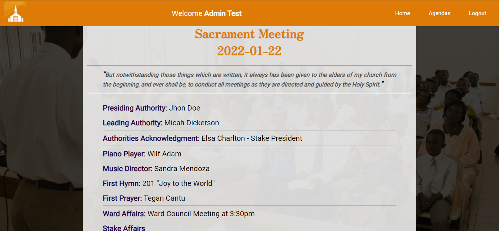

# The Sacred Planner



> This app helps leaders of The Church of Jesus Christ of Latter-day Saints to plan a sacrament meeting. Here, they can keep control of the agendas of the meetings that normally take place on Sundays.

---
**NOTE**

Run our most recent [deployed version](http://sacredplanner.xyz/).

---

### Functionalities

- [x] Common user account funtions (Signup, Login, Logout, Restore Password)
- [x] Create, record, display and edit agendas.
- [x] Send an agenda to the user email.
- [x] PWA compatibility.


## 💻 Pre-requisites

* `node v14.15.4`

## 🚀 Running <The_Sacred_Planner>

In order to install <The_Sacred_Planner>, follow this steps:

Clone the project

```bash
  git clone https://github.com/lop19029/CSE341node_project.git
```

Go to the project directory

```bash
  cd CSE341node_project
```

Install dependencies

```bash
  npm install
```

Start the server

```bash
  npm run start
```

## ☕ Using <The_Sacred_Planner>

Run the following link in your browser:

```
http://localhost:80
```

## 🤝 Collaborators

<table>
  <tr>
    <td align="center">
      <a href="https://github.com/lop19029">
        <br>
        <sub>
          <b>Alex López</b>
        </sub>
      </a>
    </td>
    <td align="center">
      <a href="https://github.com/alexandercalva">
        <br>
        <sub>
          <b>Alexander Calva</b>
        </sub>
      </a>
    </td>
    <td align="center">
      <a href="https://github.com/andrucastro">
        <br>
        <sub>
          <b>Andres Castro</b>
        </sub>
      </a>
    </td>
    <td align="center">
      <a href="https://github.com/MarcoAntonioMGDA">
        <br>
        <sub>
          <b>Marco Bustillos</b>
        </sub>
      </a>
    </td>
    <td align="center">
      <a href="https://github.com/tiagoschubert">
        <br>
        <sub>
          <b>Tiago Schubert</b>
        </sub>
      </a>
    </td>
  </tr>
</table>


## 📝 Credits

This project was done as part of the CSE 341 "Web Backend Development 2" class at [Brigham Young University](https://www.byui.edu/)

[⬆ Go to the top](#The-Sacred-Planner)<br>